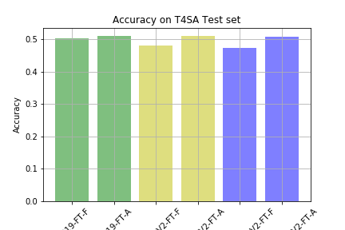
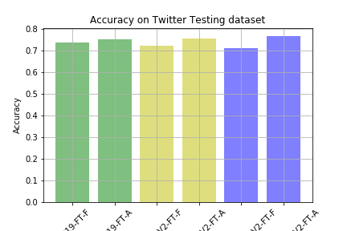
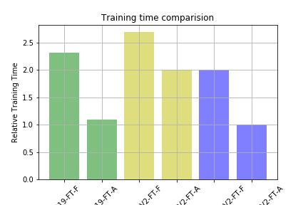
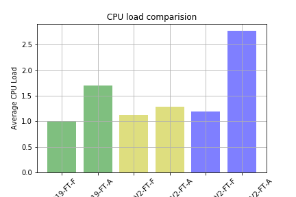
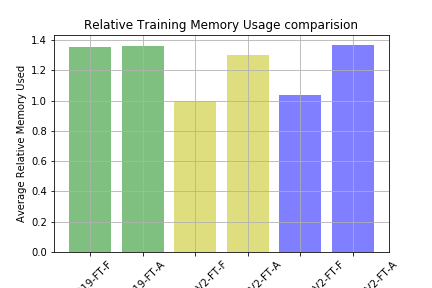
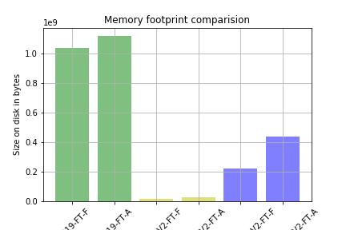

# Machine Learning Engineer Nanodegree
## Capstone Project
Saravanan Baskaran
July 1st, 2018

## I. Definition

### Project Overview
Now a days there are lots of data produced which are visual in nature.
Many a times we get pictures and videos shared in social media in addition to text.
In order to find the sentiment of a message it becomes necessary to use the visual content in addition to the textual content.
This project attempts to build and train a deep learning model based on a research paper that classify an image as expressing positive, negative or neutral sentiment.
The proposed model will be trained based on data collected from wild, ie without using any manually labeled data.

This project is based on the paper – Cross-Media Learning for Image Sentiment Analysis in the Wild by Lucia Vadicamo et al.
Where they have outlined a method to use cross media learning to train a visual sentiment classifier.
This is a first of kind approach where a classifier is trained using data from wild.

This is a very interesting pioneering effort in the field of visual sentiment classification.
We try to replicate their results from the image classification part and then try to improve upon it.
We will train models using the latest CNN architectures from imagenet contest [ILSVRC](http://www.image-net.org/challenges/LSVRC/), namely Inception and Mobilenet and compare their performance (accuracy, number of parameters and prediction speed) to the implementation of original models as described in the research paper.
We will also evaluate our models with another human labeled dataset available at [DeepSent](https://www.cs.rochester.edu/u/qyou/DeepSent/deepsentiment.html) to check if we get comparable accuracy scores listed in the [paper](https://www.cs.rochester.edu/u/qyou/papers/sentiment_analysis_final.pdf) available from the site.

### Problem Statement
This is a multi-class classification problem where we build models to classify an image as expressing positive, negative or neutral sentiment.
We train the model with the images and labels from B-T4SA dataset. Once trained the model will be able to take an image as input and classifies it into one of the three output labels positive, negative or neutral.

We will use the labeled data from the B-T4SA dataset to train our models.
We try to replicate the results from the experiment using the architecture described in the paper.
It will be trained with the downloaded dataset and set as baseline models.

We will try to improve upon the result by fine tuning two models based on InceptionResnetV2 and two on MobilenetV2 architectures trained on imagenet data. We will compare the new models performance (accuracy, prediction time and number of parameters) to the baseline model. All these models will be trained using the same training and validation data and tested against the test set from the downloaded B-T4SA dataset and TDD dataset found at [DeepSent](https://www.cs.rochester.edu/u/qyou/DeepSent/deepsentiment.html).


### Metrics
We will use accuracy as the measure to compare the performance of the baseline models. The baseline models is expected to have comparable accuracy to the one stated in the paper.
We then compare the two baseline models with the two models based on InceptionResnetV2 and two on MobilenetV2 on accuracy to check if we were able to achieve better accuracy.
We also measure and compare the baseline models with the models based on InceptionResnetV2 and MobilenetV2 based on the following metrics

- Training time of models with T4SA training data
- Average Inference time of models on Twitter Test data
- Average Relative CPU load when training on T4SA training data
- Average Relative Vsize when training on T4SA training data
- Memory Footprint when trained on T4SA training data


## II. Analysis

### Data Exploration
We use the data which is collected as part of the paper by, Lucia Vadicamo et al. This dataset is a collection containing 3 million tweets with text and images.
The images are labeled based on the content of the text in the tweet using an accurate classifier which works on text.
It is then preprocessed to create a labeled image dataset containing balanced number of images(156,862) for each of the three classes.
The dataset is available online and can be downloaded from [T4SA](http://www.t4sa.it/) site

We use the B-T4SA dataset to train and test our models.
The data set consist of colored images collected from twitter which are labeled as positive, neutral or negative based on the text content by a classifier.
The images are preprocessed to remove duplicates and near duplicates.
To balance the distribution among the three classes the number of tweet images N(156, 862) from the negative class is selected as maximum for each class.
N number of images are picked from the other two classes without replacement to get the final dataset.
We finally have 156,862 images for each category with a total of 470,586 images.
This is a balanced dataset which contains equal number of samples from each category (positive, negative and neutral).
This data is split approximately into 80% for training, 10% for validation and 10% for testing.

### Algorithms and Techniques

We will follow an approach as described in the T4SA paper to construct our solution.
We will use a CNN model to classify the images.
Training a deep CNN model from scratch is hard since we don’t have sufficient data to learn all filters.
To solve this we use a pre trained model that is trained on imagenet data as our feature extractor and then fine tune on it using our data. We use two types of fine tuning.
In one instance we lock all layers except FC and only fine tune the FC layers. In another instance we fine tune all layers with the new data.
We will train all the model for 15 epochs, with EarlyStopping and a patience of 4.
The original paper used caffe framework with a batch size of 32 and batch accumulation of 2. Our modles are implemented in keras and we use a batch size of 64 since we were able to accommodate it.
We used a learning rate of 1e-3 as mentioned in the paper.
The models are trained and fine tuned using Stochastic Gradient Descent optimizer with a momentum of 0.9.

### Benchmark

We will use a Vgg19 model trained on imagenet and finetune all its layers and call it VGG19-FT-A and only the FC layers and call it VGG19-FT-F.
We should check that we achieve an accuracy as listed in the table on B-T4SA test set and on [DeepSent](https://www.cs.rochester.edu/u/qyou/DeepSent/deepsentiment.html) test data which is called Twitter Testing Data, abbreviated as TTD. TTD had 3 sets of data based on the number of workers agreement to the classification.
We have TTD 5 where all the 5 workers agreed on a label and it contains data with high confidence. 

These two models are set as baseline models to be compared with the results in the paper and also with the other models based on InceptionResnetV2 and MobilenetV2 architectures.

The baseline models should achieve an accuracy comparable to the results given in the paper in Table 3, which is summarized here in table T1.

Table T1:

Model |TDD 5 Accuracy |  B-T4SA Accuracy
--- | --- | ---
VGG-T4SA FT-F | 0.768 | 0.506
VGG-T4SA FT-A | 0.785 | 0.513

In addition to the accuracy metrics we also collect data about the training and running cost of the model and compare the models based on them.
We collect data on metrics such as

- Training time of models with T4SA training data
- Average Inference time of models on Twitter Test data
- Average Relative CPU load when training on T4SA training data
- Average Relative Vsize when training on T4SA training data
- Memory Footprint when trained on T4SA training data

The baseline models metric is compared against the models based on MobilenetV2 and InceptionResnetV2 to select and pick the model that is best suitable for deployment to a webserver or mobile device.
The best model should have
- High Accuracy
- Low Training Time
- Low Average Inference time
- Low Average CPU load when training
- Low Average Relative VSize when training
- Low Memory Footprint

When no model satisfies all these criteria, a tradeoff should be  made where some Accuracy can be exchanged for __Low Memory_ Footprint and __Low Average Inference_ time since these are important characteristics of application that should be deployed on a scale in webservers and on mobile devices


## III. Methodology

### Data Preprocessing
The first step is preprocessing the images so, that it can be read quickly off the disk.
Reading 63GB of image data and converting in to a tensor for every epoch is a time consuming process and it has to be repeated multiple times.
The data was residing in a hard disk and during initial experiments I found that the file system was not able to supply data quickly and most of the time was spending on reading the contents of the disk.
My machine had a strong CPU coupled with an slow HDD.
I experimented with few options and found that converting data into bcolz format would speed up read operation significantly.
The data(images) is initially converted to a tensor to avoid the transformation cost at every cycle, the transformed tensors are saved on disk as a bcolz carray.
We also subtracted the mean values of RGB values of imagenet data from all the images since the models were pretrained on imagenet and finetuned on T4SA data to achieve quick convergence.
This gave fast read speed from disk and also avoided the computationally intensive transformation at every step.


### Implementation
The method given in the paper is followed to replicate its results.
The paper uses caffe, I did the experiment in Keras which was thought in the class.
The VGG19 model in Keras is not similar to the caffe implementation. It was altered by adding l2 regularizers to all conv layers to support l2_weight decay similar to caffe.

Two version of the VGG19 model are finetuned.
In one instance all the layers are freezed except for the bottleneck layers and is called VGG19-FT-F.
This is finetuned for 15 epochs using SGD with a lr rate of 1e-3.
The learning rate is reduced by a factor of 10 once every 5 epochs to stop divergence of result.
A batch size of 64 is used while training, this is opposed to the batch size of 32 used in the paper.
I found that they use batch accumulation of 2 to lower GPU footprint. So, in effect it is equivalent to using a batch size of 64. My GPU could handle a batch size of 64 and I didn’t had to make use of special techniques like batch accumulation to fit it in memory.

In the second instance all layers of the model are finetuned and this is called VGG19-FT-A.
This is also trained for 15 epochs using SGD with a lr of 1e-3. The batch size was however reduced to 48 to fit the model in memory.

The code to train the models are located in the src folder, inside the directory named after the models src/{vgg19, mobilenet and inceptionresnetv2}

Model |Implementation script to train on T4SA | Implementation script to test
--- | --- | ---
VGG-T4SA FT-F | src/vgg19/fc_layer_train_caffe_vgg19.py |  src/vgg19/result_predict_fc_layer_train_caffe_vgg19.py
VGG-T4SA FT-A | src/vgg19/all_layer_train_caffe_vgg19.py |  src/vgg19/result_predict_all_layer_train_caffe_vgg19.py
MobilenetV2-FT-F | src/mobilenet/fc_layer_train_mobilenet.py |  src/mobilenet/result_predict_fc_layer_train_mobilenet.py
MobilenetV2-FT-A | src/mobilenet/all_layer_train_mobilenet.py |  src/mobilenet/result_predict_all_layer_train_mobilenet.py
InceptionResnetV2-FT-F | src/inceptionresnetv2/fc_layer_train_inceptionresnetv2.py |  src/inceptionresnetv2/result_predict_fc_layer_train_inceptionresnetv2.py
InceptionResnetV2-FT-A | src/inceptionresnetv2/all_layer_train_inceptionresnetv2.py |  src/inceptionresnetv2/result_predict_all_layer_train_inceptionresnetv2.py

All these scripts can be run by issuing the command ```ipython <script_name> ``` at the terminal.
The logs are saved in the logs directory located at src/{vgg19, mobilenet and inceptionresnetv2}/logs.
The result of the script, trained model and result array are saved in the saved_models directory located at src/{vgg19, mobilenet and inceptionresnetv2}/saved_models.

The test script uses the models produced by the training scripts and the test script should be run only after running the train script atleast once to completion.


### Refinement
I run the models frequently to test different set of values for parameters such as batch_size, momentum , learning rate etc to try improve on the accuracy and other metrics.
Running the model on the entire T4SA training data is a time and resource intensive process. I modified the scripts to make it easy to experiment with subsets of data.

To experiment with subset of the data, all scripts has a ```percent``` flag. This flag controls the percentage of input data that is used in the training process.
It also adjust the output files based on the ```percent``` flag.
When running on a subset of the input data by using ```percent``` flag, prefix ```test``` is added to all logs and models that are saved to differentiate it from the actual runs.

To debug models after a change, I used to test for convergence on a familiar dataset. I used the dataset from dog breed dataset to test the models after a change before running them on T4SA training data.
All the scripts are modified to be able to test on dog breed dataset as part of debugging the model.

## IV. Results

### Model Evaluation and Validation
The models are evaluated by comparing the accuracy of the models with the results given in the paper.
I was able to replicate the result given in the paper.
I got an accuracy of  0.5042 with VGG19-FT-F and 0.5102 with VGG19-FT-A which is similar to the accuracy of 0.506 and 0.513 as reported in the paper
The more complex models didn't improved much on the accuracy. The MobilenetV2-FT-F got an accuracy of 0.4816 while the MobilenetV2-FT-A got an accuracy of 0.5108.
The inceptionresnet based model did slightly worse, with InceptionResnetV2-FT-F getting 0.4727 and InceptionResnetV2-FT-A getting 0.5078.
This is summarized in the following table and graph
   
    Table 2 : Accuracy of models on T4SA test set
   | Model                  | Accuracy |
   |------------------------|----------|
   | VGG19-FT-F             |   0.5042 |
   | VGG19-FT-A             |   0.5102 |
   | MobilenetV2-FT-F       |   0.4816 |
   | MobilenetV2-FT-A       |   0.5108 |
   | InceptionResnetV2-FT-F |   0.4727 |
   | InceptionResnetV2-FT-A |   0.5078 |
   
Here is the graph of the result
   
   
The accuracies of the models on the Twitter Training Dataset is also measured.
Here we can see that the more complex models like InceptionResnetV2-FT-A gives a better performance compared to less complex models like  VGG19-FT-A and MobilenetV2-FT-A.
We can also observe that the model fine tuned on all layers were able to catch the patterns in the data better compared to the models that are finetuned only on the fully connected layers
The results are summarized in the following table and graph
   
    Table 3 : Accuracy of models on Twitter Testing dataset
    
   | Model                  | Accuracy |
   |------------------------|----------|
   | VGG19-FT-F             | 0.740363 |
   | VGG19-FT-A             | 0.755102 |
   | MobilenetV2-FT-F       | 0.722222 |
   | MobilenetV2-FT-A       | 0.757370 |
   | InceptionResnetV2-FT-F | 0.714286 |
   | InceptionResnetV2-FT-A | 0.768707 |


 
   

### Justification
We were able to achieve comparable accuracy to the results stated in the paper.
We also defined and measured 5 other metrics in our experiments to evaluate the models and select the best model that is suitable for deploying to a webserver and mobile app.
 
The training time and inference time are also important factors in determining the usefulness of a machine learning model in a constrained environment.
Most real world uses care about the training time and even more important is the inference time.
Training time is calculated on the GPU while the inference time is calculated on the CPU.
This is because most of the time training is done on a machine with a powerful GPU and the trained model is usually deployed on webservers which supports only CPUs.
The trained models are also deployed on less powerful devices like mobile phones so, the inference performance is calculated on CPU only system.

The models are trained for 15 epochs with EarlyStopping callback with a patience of 5.
So, if the validation loss doesn't improve for 5 consecutive epochs then the training is stopped even before the completion of 15 epochs.
The time is calculated as a ratio relative to the quickest model to train. This is to account for difference in the computing infrastructure and make meaningful comparision between models
We can see that the InceptionResnetV2 is the fastest to train. It converged quickly and got stopped early since there is not much improvement in the later epochs.
We can also observe that models where all layers are trained converge quickly than training only fully connected layers
   
Here is the table and graph of the result

     Table 4 : Training time of models with T4SA training data.
   | Model                  | Relative Training Time | Actual Training Time in hours |
   |------------------------|------------------------|-------------------------------|
   | VGG19-FT-F             |                  2.316 |                        178005 |
   | VGG19-FT-A             |                  1.098 |                         84405 |
   | MobilenetV2-FT-F       |                  2.692 |                        206839 |
   | MobilenetV2-FT-A       |                    2.0 |                        153675 |
   | InceptionResnetV2-FT-F |                  2.004 |                        153977 |
   | InceptionResnetV2-FT-A |                    1.0 |                         76846 |
   
   
   
The inference time is calculated by running the models on a subset of twitter training data.
Inference time is calculated on the CPU since the models will be usually deployed on a webserver which has only CPU.

Here is the table and graph of the result

       Table 5: Average Inference time of models on Twitter Test data.
    | Model                  | Average Inference Time (15 images) (S) | Standard Deviation (mS) |
    |------------------------|----------------------------------------|-------------------------|
    | VGG19-FT-F             |                                   10.4 |                    14.2 |
    | VGG19-FT-A             |                                   10.4 |                    45.8 |
    | MobilenetV2-FT-F       |                                   1.78 |                    22.5 |
    | MobilenetV2-FT-A       |                                   1.78 |                    12.7 |
    | InceptionResnetV2-FT-F |                                   5.25 |                    10.5 |
    | InceptionResnetV2-FT-A |                                   5.26 |                    30.0 |
      
We see that MobilenetV2 has the quickest test time followed by InceptionResnetV2 and VGG19 models.
If are looking for a model that is quick with acceptable accuracy MobilenetV2 model is the way to go.

In addition to the training time, inference time and the accuracy of the models we should also consider the resource required to train the models.
Here the memory usage and CPU usage of the models are compared against one another. 
We use a relative comparision here since the actual numbers will depend on the actual hardware that is used and we are interested only the relative ease with which the models can be trained.
    
Here is the table and graph for CPU usage

       Table 6: Average Relative CPU load while training on T4SA training data
    | Model                  | Average Relative Load |
    |------------------------|-----------------------|
    | VGG19-FT-F             |                   1.0 |
    | VGG19-FT-A             |                 1.705 |
    | MobilenetV2-FT-F       |                 1.124 |
    | MobilenetV2-FT-A       |                 1.281 |
    | InceptionResnetV2-FT-F |                 1.194 |
    | InceptionResnetV2-FT-A |                 2.775 |

 
 
      
We can see that InceptionResnetV2 models are high on CPU load while the MobilenetV2 has the least CPU load and the VGG19 models are inbetween.

Here is the table and graph for vsize usage

      Table 7: Average Relative vsize while training on T4SA training data
    | Model                  | Average Relative Memory Usage |
    |------------------------|-------------------------------|
    | VGG19-FT-F             |                         1.354 |
    | VGG19-FT-A             |                         1.364 |
    | MobilenetV2-FT-F       |                           1.0 |
    | MobilenetV2-FT-A       |                         1.301 |
    | InceptionResnetV2-FT-F |                          1.04 |
    | InceptionResnetV2-FT-A |                         1.369 |

    


   
We can see that MobilenetV2 models has less memory demand followed by InceptionResnetV2, while the VGG19 models places a heavy demand on memory

Finally we also measure and compare the memory footprint of the trained and saved models.
Memory footprint plays an important role since the model has to be loaded into memory when deployed.
It determines the memory usage and subsequently the cost of running the application since many cloud providers charge for infrastructure based on the memory requirement.
It also determines the load time and scaling out time, a model with less memory footprint is quick to load and as a result easy to scale out.
Smaller models are also preferred on mobile devices because of limited resources and low bandwidth connection.
An app with a small apk size can be downloaded and used easily and can be updated frequently.
    
Here is the table and graph for memory footprint

      Table 8: Memory footprint of models trained on T4SA training data
    | Model                  | Size on disk in bytes |
    |------------------------|-----------------------|
    | VGG19-FT-F             |            1036656072 |
    | VGG19-FT-A             |            1116766456 |
    | MobilenetV2-FT-F       |              15544744 |
    | MobilenetV2-FT-A       |              28407960 |
    | InceptionResnetV2-FT-F |             219423224 |
    | InceptionResnetV2-FT-A |             436709216 |
    
  


## V. Conclusion

### Reflection
We used the labeled data from the B-T4SA dataset to train our models ( VGG19-FT-F, VGG19-FT-A ).
I was able to replicate the results from the experiment using the architecture described in the paper, these are set as baseline models.

I fine tuned two models based on InceptionResnetV2 and two on MobilenetV2 architectures trained on imagenet data.
All these models are trained using the same training and validation data from  B-T4SA dataset and tested against TDD dataset found at [DeepSent](https://www.cs.rochester.edu/u/qyou/DeepSent/deepsentiment.html) 

We then compared the models accuracy to the baseline models and to the results stated in the paper.
We also compared the models performance based on the following metrics

Accuracy
Training time
Inference time
CPU load
Memory load
Model Memory Footprint

The baseline models achieved similar accuracy as stated in the paper.
We could see that the MobilenetV2 models achieved similar accuracy as the baseline models but has superior training and inference characteristics.
The MobilenetV2-FT-A has a better accuracy compared to MobilenetV2-FT-F, but it falls behind slightly on other performance characteristics compared to MobilenetV2-FT-F model.
We have to make a tradeoff here and the MobilenetV2-FT-A is selected for making the webapp, this is because of the high accuracy and almost similar inference time as MobilenetV2-FT-F model.
The MobilenetV2-FT-F model beat MobilenetV2-FT-A model in certain characteristics like Training time, CPU load, Memory load and Model Memory Footprint.
But these are one time training cost and also the difference between MobilenetV2-FT-A and MobilenetV2-FT-F are not drastic as compared to other models, and they generally have the best performance characteristics of the three model types tested.
I selected the MobilenetV2 based model MobilenetV2-FT-A for creating the webapp based on the results and observation we have.

The InceptionResnetV2 based models were also better than the baseline models but the MobilenetV2 based models are better than them.

I created a sample webapp based on MobilenetV2-FT-A model.
It is used to demonstrate deploying the model to a webserver as a micro service.
I also created a basic frontend to interact with the micro service and label the uploaded image as having positive, negative or neutral sentiment.


### Improvement
I would like to make few improvements and extend on this work, some of them I had planned to do are as follows

- Implement the solution with pytorch and try improving the accuracy, sample data from all three sections (train, test and valid) and test the upper limit on the accuracy that can be achieved on
this dataset
- Implement circular learning rate and varying cycle from fast.ai library and try to train it faster.
- Create a mobile app, deploy the model in mobile and check the framerate achieved, try to extend to find sentiment of scene from camera based on framerate reached.

-----------
